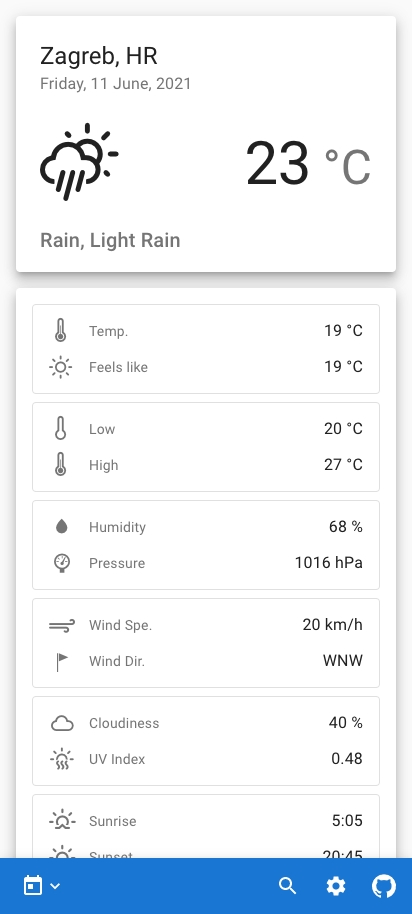
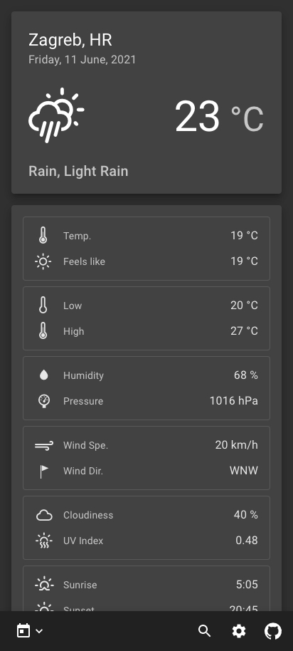
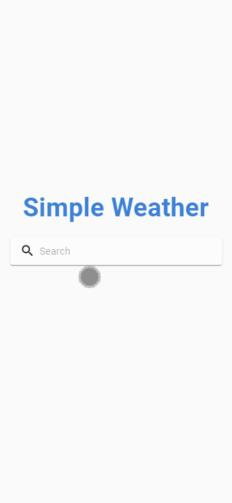

# Simple Weather

A web application for displaying weather forecast information, with support for phones, tablets, laptops/desktops.

## Table of contents

- [Features](#features)
- [Showcase](#showcase)
- [Demo](#demo)
- [Technologies](#technologies)

## Features

- Display current, daily or hourly weather forcast
- Choose between metric (°C, km/h, mm), imperial (°F, mph, in) or scientific (°K, m/s, mm) units
- Choose between light or dark theme
- Units and theme preferences are stored using cookies
- Supports layouts for phones, tablets and laptops/desktops
- Search suggestions for different locations with the same name

## Showcase

| iPhone 4                         | iPhone 5, SE                            | iPhone 6, 7, 8                             |
| -------------------------------- | --------------------------------------- | ------------------------------------------ |
|  |  |  |

| iPhone 6, 7, 8 Plus                                  | iPhone X                         | Samsung Galaxy S8                                   |
| ---------------------------------------------------- | -------------------------------- | --------------------------------------------------- |
|  |  |  |

| iPad                     | iPad PRO                         |
| ------------------------ | -------------------------------- |
|  |  |

| Laptop/Desktop                               |
| -------------------------------------------- |
|  |

| OpePlus 7T - Light Mode                         | OnePlus 7T - Dark Mode                        |
| ----------------------------------------------- | --------------------------------------------- |
|  |  |

## Demo

Live app deployed to Netlify (client) and Heroku (server): [Simple Weather](https://priceless-tesla-d4503b.netlify.app/)

<!-- Mobile demo: -->

<!-- Tablet/Laptop/Desktop demo: -->

## Technologies

Project is created with:

- Core:
  - [ReactJS](https://reactjs.org/)
  - [React Router](https://reactrouter.com/)
  - [Axios ](https://www.npmjs.com/package/axios)
- Styling:
  - [Material UI](https://material-ui.com/)
  - [Weather Icons](https://erikflowers.github.io/weather-icons/)
- State managment:
  - [Redux](https://redux.js.org/)
  - [Redux Thunk](https://github.com/reduxjs/redux-thunk)
- Other:
  - [Luxon](https://moment.github.io/luxon/)
  - [Universal Cookie](https://github.com/reactivestack/cookies/tree/master/packages/universal-cookie#readme)
- APIs:
  - [OpenWeather](https://openweathermap.org/api)
- Tools:
  - [Postman](https://www.postman.com/)
  - [Google Chrome](https://www.google.com/chrome/)
  - [Responsively App](https://responsively.app/)
  - [VS Code](https://code.visualstudio.com/)
